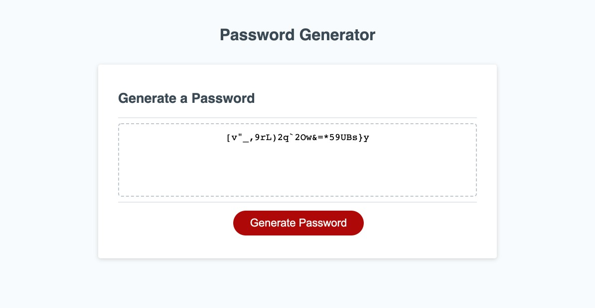

# homework3-PasswordGenerator

This is the link to the following assignment: [link](https://valbona1992.github.io/homework3-PasswordGenerator/)

## Summary
This assignment required me to modify starter code to create an application that enables employees to generate random passwords based on criteria that they’ve selected.  

Below is a summary of what I implemented. 

* Added function to generate password that provided prompts for the user to select multiple password criteria.
* Added variables for the criterias including numbers, special characters, lowercase characters, and uppercase characters.
* Added alerts if the password did not meet the length criteria and if no criteria was selected.
* Created a loop that runs as many times as the password length provided by the user.
* Selected a random characters and added to the password holder as many times as indicated in the loop.
* The function returns the final password which is displayed in the browser.

## Screenshot
 
